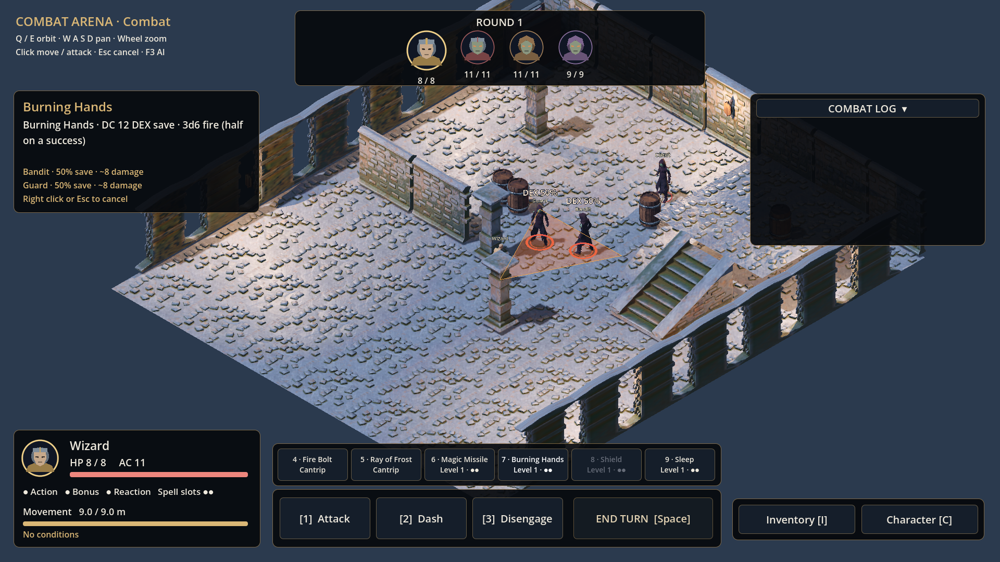

# The RPG

Godot-4-Projekt für das geplante Fantasy-RPG. Aktuell enthält es die erste
Asset-Showcase aus Auftrag 01; **noch kein spielbares RPG**.

## Starten

1. Repository mit `git clone` oder als GitHub-ZIP herunterladen.
2. `project.godot` mit **Godot 4.7.2 stable, Standard-Ausgabe** öffnen.
3. Import abwarten, dann **F6** für `scenes/showcase/asset_showcase.tscn` oder **F5**.

Die Szene zeigt zwei menschliche Grundmodelle und vier Kleidungsproben in einem
kleinen Dungeon. Sie dient der Art-Prüfung; die Kleider sind noch keine fertig
zusammengesetzten Spielfiguren. Die beiden Grundmodelle tragen keine Klassenrüstung.

| Bedienung | Wirkung |
|---|---|
| Dropdown oder Q / E | Animation wechseln |
| Pfeiltasten oder rechte Maustaste ziehen | Kamera drehen |
| Mausrad | Zoom |
| R | Ansicht zurücksetzen |
| L | Atmosphärische Beleuchtung / helle Prüfansicht |

Forward+ ist die Hauptdarstellung mit SSAO, Glow und volumetrischem Nebel.
Für Geräte ohne Vulkan: `godot --rendering-method gl_compatibility --path .`.
Dieser Fallback hat kein SSAO und keinen volumetrischen Nebel.

## Prüfen

```sh
godot --headless --editor --import
godot --headless --script res://tools/check_showcase.gd
```

Der Check prüft die geladenen Modelle, die 42 nutzbaren Animationsclips auf allen
sechs Proben, Knochenreferenzen, PBR-Texturzuordnung, Tastatur-Umschaltung und
Übersetzungen. Er ersetzt die visuelle Freigabe der Modelle durch den Owner nicht.

## Stand und nächste Arbeit

Details zu Quellen, Lizenzen, Animationen und fehlenden Modellen stehen in
[assets/README.md](assets/README.md) und [assets/CREDITS.md](assets/CREDITS.md).
Das kuratierte Asset-Set bleibt unter 50 MB und wird vollständig als normale Git-Dateien gespeichert. Falls spätere Assets diesen Umfang überschreiten, muss Git LFS gemäß Auftrag 01 eingerichtet werden.

**Auftrag 01 ist teilweise umgesetzt und noch nicht abgeschlossen.** Die
kostenlosen, überprüften Figurenpakete decken die vollständigen Anforderungen an
12 Klassen, 3–4 Gegner und einen Boss nicht ab. Die offene Asset-Entscheidung steht
in [handover/05-10-2026.md](handover/05-10-2026.md).
Auftrag 02 baut mit Owner-Freigabe auf der Teil-Showcase auf. Auftrag 03 darf
parallel am Regelkern arbeiten; Auftrag 04 wartet auf beide Grundlagen.


## Foundation (Auftrag 02)

Godot **4.7.2 stable** ist für Editor, Tests, CI und Export festgelegt.
GUT **9.6.1** liegt samt MIT-Lizenz unter `addons/gut/`; keine Plugin-Installation nötig.

```sh
godot --headless --editor --import
./tests/run_tests.sh
```

Alternativ (auch in PowerShell):

```sh
godot --headless -s addons/gut/gut_cmdln.gd -gdir=res://tests/unit -ginclude_subdirs -gexit
```

`GODOT_BIN=/pfad/zu/godot ./tests/run_tests.sh` wählt unter Unix eine lokale Binary.
Unterverzeichnisse einschließlich `tests/unit/rules/` werden mitgeprüft. GitHub Actions
führt Import, Tests, Showcase-Check, Export und einen Windows-Starttest bei jedem
Push auf `main` aus. Der Starttest ist headless; die grafische Windows-Prüfung bleibt
Teil des Owner-Playtests. Das Build liegt als Actions-Artefakt `TheRPG-Windows` vor.

### Architektur

- `Game` besitzt den `GameState` (Actor-Daten mit HP/Position, Zugreihenfolge, Runde, Modus).
  `Game.state` liefert eine tiefe Datenkopie; Änderungen daran ändern das Spiel nicht.
  Actor-Daten dürfen keine Node-/Resource-Referenzen enthalten.
- Nur `CommandBus.submit(command)` verändert den autoritativen Zustand. Validierung
  bekommt eine separate Kopie, erfolgreiche Anwendung wird vor den Signalen übernommen.
  `Game._commit_state()` ist die interne Bus-Schnittstelle und darf nicht aus Szenen
  aufgerufen werden. Das ist eine Architekturgrenze, keine Sicherheits-Sandbox für Scripts.
- Szenen beobachten `EventBus.state_changed` und lesen danach `Game.state`.
  Der Bus meldet zusätzlich `command_applied(command, result)` beziehungsweise
  `command_rejected(command, Error)`. Während der Verarbeitung wird ein erneuter
  Submit mit `ERR_BUSY` abgewiesen; dessen Signal folgt deferred.
- `EndTurnCommand` demonstriert ausschließlich einen Zugwechsel mit Rundenzähler.
  Es gibt noch keine Kampfregeln. `CommandCodec.decode()` akzeptiert ausschließlich
  bekannte Typen und geprüfte Felder; niemals Scriptpfade aus Netzwerkdaten laden.
- Alle Zufallszahlen kommen aus `Rng`; reine Regeln erhalten `Rng.rng` als Parameter.
  `Rng.set_seed(123)` ermöglicht reproduzierbare Abläufe.
- `src/rules/`, `data/classes/` und `tests/unit/rules/` gehören zum parallelen Auftrag 03.

### Eingaben und Übersetzungen

Projektauflösung: 1920 × 1080, anfängliches Desktopfenster: 1280 × 720.
Neue Gameplay-Aktionen sind in `project.godot` vorbereitet: Q/E drehen, WASD schwenken,
rechte Maustaste drehen, mittlere Maustaste schwenken, Mausrad zoomen,
linke Maustaste auswählen, Escape abbrechen, Enter Zug beenden.
Sie steuern noch kein Gameplay. Die vorhandene Galerie behält ihre oben beschriebenen
Aktionen. Spielertexte bleiben in `localization/strings.csv` (`keys,en`) und werden
mit `tr("KEY")` angezeigt; diese Foundation fügt keine sichtbaren Texte hinzu.

### Windows-EXE exportieren

1. Godot 4.7.2 öffnen und unter **Editor → Manage Export Templates** die passenden
   **4.7.2 stable** Exportvorlagen installieren.
2. **Project → Export → Windows Desktop** auswählen.
3. Als `build/TheRPG.exe` exportieren (Release). **Embed PCK** ist bereits aktiviert.

CLI nach dem ersten Projektimport:

```sh
mkdir -p build
godot --headless --export-release "Windows Desktop" build/TheRPG.exe
```

Unter PowerShell den Ordner mit `New-Item -ItemType Directory -Force build` anlegen.
Die einzelne EXE enthält die Spieldaten; keine separate `.pck` verteilen. `build/`
ist in Git ignoriert. Zum kurzen Starttest: `build/TheRPG.exe --headless --quit-after 60`.
Die EXE startet die Kampfarena. GUT, Tests, Tools und Dokumentation
werden vom Export ausgeschlossen.

## Combat arena (Auftrag 04)

The project now starts in `scenes/arena/arena.tscn`. Click ground to move or an enemy to
attack; Q/E rotate, WASD/middle mouse pan, wheel zoom, 1 selects attack, Space ends a turn, 2 dashes,
3 disengages, F3 shows AI scores. Every roll appears on screen. The level-one Fighter
faces Guard, Bandit and Cultist stat blocks; death ends the run.

This is a **technical combat build with provisional character art**. The three enemy
roles currently share the cultist test model; ranged weapon art and the correct ranged
animation are still missing. See [docs/COMBAT.md](docs/COMBAT.md) for exact scope and tests.
The original showcase remains available at `scenes/showcase/asset_showcase.tscn`.
GitHub Actions provides `TheRPG-Windows` and `Arena-previews` artifacts.

## Inventory and character sheet

In the arena, I opens the inventory (equip weapons and armour, drink potions) and C the
character sheet. Details and rules: [docs/UI.md](docs/UI.md) section 9.

## Menü, Heldenerstellung und Ironman (Auftrag 06)

**F5** startet jetzt im Hauptmenü (`scenes/menu/main_menu.tscn`): NEUES SPIEL,
FORTSETZEN (nur mit Speicherstand), OPTIONEN, BEENDEN. Die Heldenerstellung bietet
Kämpfer und Magier, Körper, Aussehen (aus `assets/characters/hero_looks.json`, sonst die
vorhandenen Modelle) und Namen. Im Spiel öffnet **Esc** das Pausenmenü mit
„Speichern und ins Menü“. Ironman: ein einziger Speicherstand in `user://ironman.save`,
geschrieben nur beim Verlassen, gelöscht beim Tod. Optionen liegen in `user://settings.cfg`.
Die Arena allein startet weiter mit `scenes/arena/arena.tscn` und dem Test-Kämpfer.

```sh
godot --headless tests/integration/check_menu.tscn   # ganzer Ablauf bis zum Tod
bash tests/integration/check_menu_capture.sh godot    # Bilder (braucht xvfb-run)
```

## Spells and class features (prompt 05)

The Wizard casts Fire Bolt, Ray of Frost, Magic Missile, Burning Hands, Sleep and, as a
reaction, Shield (SRD 5.2, data in `data/spells/`, rules in `src/rules/spells/`). In the arena
the spell buttons sit above the action bar (keys **4-9**, slot pips show what is left);
clicking one shows the range, the area template on the ground, who is caught (red enemy,
yellow ally) and the hit chance or "DC 12 DEX save" before you cast. When an enemy hits the
Wizard and Shield would turn it into a miss, the game asks before any damage. The Fighter
gets Second Wind (key 4, bonus action) and Weapon Mastery (Sap on the longsword). **F4**
outside combat swaps the arena hero between Fighter and Wizard.

```sh
godot --headless tests/integration/check_spells.tscn   # auto-played Wizard fight
bash tests/integration/capture_spells.sh godot          # docs/arena-spell-*.png (needs xvfb-run)
```


