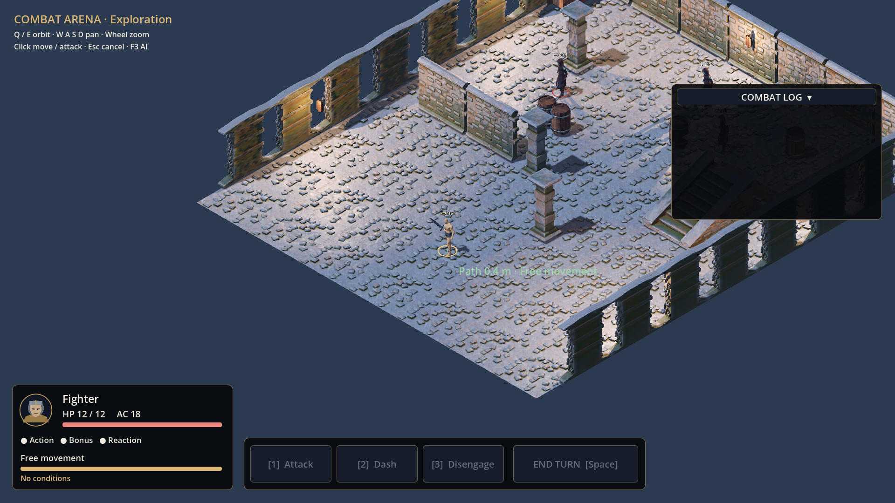
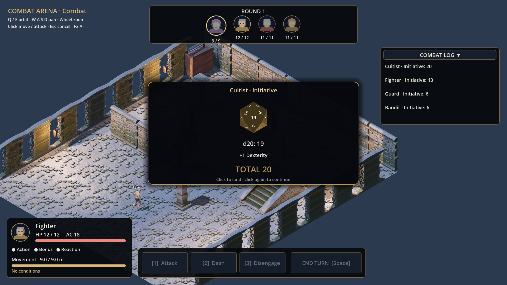

# Combat arena — Auftrag 04

Die Arena ist eine technische Integration von Foundation, SRD-Regelkern, Navigation,
Kampf-Commands, Utility-KI und Darstellung. **Die endgültige Art-Abnahme ist offen:**
alle drei Gegnerrollen verwenden dasselbe Kultisten-Testmodell aus 01b; der Fighter
verwendet den vorhandenen bewaffneten Grundkörper. Guard, Bandit und Cultist sind echte
unterschiedliche Statblocks, aber noch keine drei eigenständigen Figurenassets.
Die Fernkampfgeste ist ein vorhandener Release-Clip; ein passendes Armbrust-/Bogenmodell
und eine entsprechende Animation fehlen. Keine dieser Lücken wird als fertige Klassen-
oder Gegneroptik ausgegeben.

## Start und Bedienung

`scenes/arena/arena.tscn` ist die Hauptszene. Linksklick bewegt die Figur bzw. greift einen
Gegner an. Hover zeigt Wegkosten, Restbewegung, Gelegenheitsangriffsgefahr oder Trefferchance,
Schadenswürfel und Deckung. Q/E dreht, WASD und mittlere Maustaste verschieben, Mausrad zoomt.
1 aktiviert die Angriffsauswahl, Space beendet den Zug, 2 führt Dash aus, 3 Disengage,
F3 zeigt die bewerteten KI-Optionen.
Rechtsklick/Esc verwirft die aktuelle Zielvorschau; ein bereits validierter Befehl wird
nicht rückgängig gemacht. Ein Klick auf die Würfelanzeige lässt die Würfel landen; der
nächste Klick schließt den angezeigten Wurf. Kein Wurf wird dadurch neu gewürfelt.

Der Held ist ein menschlicher Fighter auf Stufe 1 mit STR16/DEX14/CON14/INT10/WIS12/CHA8,
12 HP und AC18 durch Kettenrüstung/Schild. Die Arena ist absichtlich gefährlich; Gegner
haben unveränderte SRD-Statblocks. Klassenfähigkeiten sind wie in Auftrag03 noch nicht aktiv.
Bei 0 HP endet der Lauf. „Leave arena“ führt zur vorhandenen Asset-Galerie;
Startmenü/Spielstandverwaltung gehören zu den späteren Aufträgen. Der tote Lauf wird nicht
neu initialisiert. Nach allen Gegnern auf 0 HP wird die Erkundung fortgesetzt.

## Zustandsgrenze und Ablauf

Szenen lesen `Game.state`. `CommandBus` bleibt die einzige Schreibgrenze.
`SetupArenaCommand` erzeugt einen leeren Testlauf aus `CharacterSheet` und den drei
Monsterressourcen. Sichtkontakt innerhalb 12 m unterbricht Erkundungsbewegung an der
bereits erreichten Position; `StartCombatCommand` würfelt Initiative. Gleichstände verwenden
die Regelkern-Policy. Nur die beginnende Figur erhält Aktion, Bonusaktion, Reaktion und
Bewegung zurück; Tote werden übersprungen.

`MoveCommand`, `AttackCommand`, `DashCommand`, `DisengageCommand` und `EndTurnCommand`
haben einen expliziten JSON-Codec. Clients liefern Ziel/Actor-ID, niemals Wegkosten,
Deckung, Würfel oder fertige Treffer. Initialisierung und Simulationstakte sind interne
Commands und nicht im externen Codec erlaubt. Die bisherige Foundation ist weiterhin
lokal; eine Netzwerksitzung ist nicht Teil dieses Auftrags.

Eine Bewegung reserviert ihren vollständigen Navpfad und dessen 3D-Länge in Metern.
`AdvanceCombatCommand` lässt die autoritative Position entlang dieses Pfades laufen.
Gelegenheitsangriffe pausieren am ersten Austritt aus einer gegnerischen Nahkampfreichweite,
auch bei Wegen, die erst in diese Reichweite hinein- und dann wieder hinausführen.
Reaktionen werden einzeln verbraucht; Disengage schützt. Vorhandene Nahkampf-Seitenwaffen
werden auch bei einem primär fernkämpfenden Gegner für solche Angriffe berücksichtigt.

Angriffe beginnen mit einer 0,8-s-Timeline. Erst bei 0,4 s werden Würfel und HP angewendet,
exakt einmal. Die Figurenanimation wird auf diesen Kontaktzeitpunkt abgebildet. Der
Schwertclip verwendet den Kontaktbereich Frame13/30; die provisorische Fernkampfgeste
verwendet ihren Release-Zeitpunkt. Treffer, Schaden und Tod bleiben getrennte Ereignisse.
Kritische Treffer erhalten zusätzlich eine kurze Verlangsamung. Ein laufendes Würfelpopup
verhindert neue Spieler-/KI-Aktionen; laufende Angriffe werden sauber beendet.

## Gelände und Regeln

Der Raum enthält Kit-Böden/-Wände, Säulen, Fassdeckung, einen schmalen Durchgang und eine
2-m-Plattform mit Treppe. Das gespeicherte NavigationMesh wird aus den tatsächlichen
Level-Kollidern gebacken, inklusive Agentenradius und Treppensteigung:

```sh
godot --headless --script tests/integration/bake_arena.gd
```

Die Nav-Abfrage akzeptiert nur erreichbare Endpunkte. Lebende Figuren blockieren
Laufwege; Umwege bleiben auf dem Navmesh. Sicht/Deckung verwenden fünf Strahlen gegen
Umgebungs-Kollisionen zu verschiedenen Körperpunkten: zwei oder drei verdeckte Punkte
geben +2 AC, vier +5 AC, fünf verhindern den Angriff. Deckung gibt keinen zusätzlichen
Nachteil; die widersprüchliche Beispielbeschriftung in `docs/UI.md` wird zugunsten des
expliziten Auftrags04 korrekt als AC-Bonus umgesetzt. Mindestens 1,5 m Höhenunterschied
geben bei Fernkampf Vorteil. Gegner innerhalb 1,5 m und lange Reichweite geben Nachteil;
die bestehende Vorteil/Nachteil-Aufhebung bleibt erhalten. Flankieren verbessert die
Position und Sichtlinie, verleiht keinen erfundenen zusätzlichen Regelbonus.

Guard (SRD5.2 S293), Bandit (S258) und Cultist (S275) haben je ein eigenes Resource.
Der Kultist behält den zusätzlichen konstanten nekrotischen Schadenspunkt; dieser wird
bei Krit nicht verdoppelt. Weitere Angriffe sind als Daten vorhanden, der Hauptangriff
ist in diesem Auftrag fest; ein Inventar-/Waffenwechsel wird nicht vorgetäuscht.

## KI und Darstellung

Die KI bewertet jeden legalen Angriff und erreichbare Deckungs-/Höhen-/Umgehungs-/Abstands-
positionen. Trefferchance, Erwartungsschaden, exakte Tötungswahrscheinlichkeit, erreichbare
Angreifer, Deckung, Höhe, Wegkosten und Gelegenheitsangriffe gehen in die Bewertung ein.
Brute, Archer und Coward haben eigene `.tres`-Gewichte; unter 30% HP erhält Rückzug mehr
Gewicht. Alle gewählten Aktionen laufen durch dieselbe Validierung und CommandBus.

Der HUD zeigt Initiativeportraits, HP, AC, Aktionen, Bewegung, Tooltip und Kampfprotokoll.
Jeder Initiative-, Angriffs- und Schadenswurf läuft durch eine FIFO-Präsentation, mit jedem
Einzelwürfel, Modifikatorquelle und AC-Vergleich. Die d20 sind tatsächlich dreidimensional,
nummeriert und landen mit der gewürfelten Fläche zur Kamera. Vorteil/Nachteil behält beide
Würfel sichtbar; der verworfene Würfel ist grau. Alle Spielertexte stehen in
`localization/strings.csv`. Das UI erstellt Portrait-Nodes nur bei sichtbaren Änderungen neu.

## Prüfungen

```sh
tests/run_tests.sh
godot --headless tests/integration/check_arena.tscn
godot --headless tests/integration/check_combat_ui.tscn
bash tests/integration/capture_arena.sh godot
```

Der Arenatest verwendet echte Navigation, Kollisionen, Commands und KI bis zum Kampfende.
Der UI-Test prüft FIFO, Skip ohne Neu-Würfeln, zurückgestellte Todesanzeige, Portrait-Reuse
und alle zwanzig d20-Landeflächen. Unit-Tests prüfen unter anderem Wegkosten, OA am
Reichweitenaustritt, Reaktionsreset, Treffertiming, ungültige Netzwerkdaten, Deckung/Höhe,
KI-Entscheidungen und echte Animationsclips. CI führt dieselben Prüfungen aus, rendert
zwei Vorschauen, exportiert eine einzelne Windows-EXE und startet diese headless auf Windows.
Ein Headless-Start ersetzt keinen visuellen Windows-Playtest durch den Owner.

## Geprüfter Build und echte Aufnahmen

Code-Commit `eb38877e510a5d1cce42917b272f76967e8d9f8f` wurde in
[GitHub Actions 37419092406](https://github.com/Wuerfelduell/Testrepo/actions/runs/37419092406)
vollständig geprüft: 118 Unit-Tests mit 2945 Assertions; 20 Arena-, 58 UI- und 26
Actor-Navigationsprüfungen; 17779 Showcase-Prüfungen; Windows-Export und nativer
Windows-Headless-Start. Die einzelne EXE steht im Artefakt `TheRPG-Windows`.

Die folgenden unbearbeiteten 1920×1080-Aufnahmen stammen aus demselben Lauf, aus Godot
mit Compatibility/OpenGL auf Linux. Das Kampfbild hält den ersten echten Initiativewurf
für die Aufnahme an; es verwendet reguläre Command-/RNG-Daten. Die Bilder bestätigen
Lesbarkeit und Anordnung des HUD, ersetzen aber keine vollständige visuelle Animations-
oder Forward+-Abnahme. Die oben genannten Art-Lücken bleiben offen.




